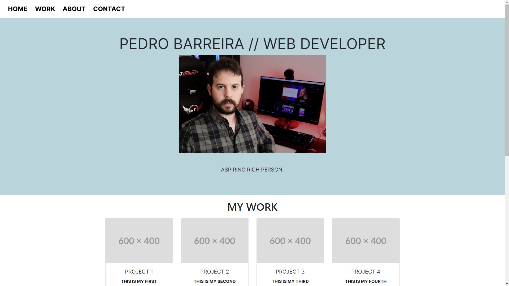

# Bootstrap Portfolio

## Description

In this project, I re-imagined my previously created website, using the bootstrap library to do it.
This project serves as a showcase of my bootstrap skills, as I used various different elements such as jumbotrons, cards and the grid system.
Like the previous non-bootstrap website, this new website is responsive and works in computers, tablets or smartphones, reacting and adapting to different screensizes for optimal display.
In the portfolio, I show a recent headshot of myself, an about me section, my most recent web development projects (placeholders for now), and a section that shows various contact details.

Link to the finished website: https://pedromiguel93.github.io/WebDevPortfolio/

## Screenshots

